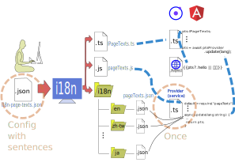

# Goal
As the conept depicted in this scratch, 

[]

,as a developer, I hope that:

1. Once I add some new sentences into my App, I hope that I can embed those new sentences for all the other languages by google translate Api just by one command such as `npm run i18n`.

2. If there are some properties such as `address` that I don't want to be translated, I can easily achieve this goal by declaring it in the config file.

3. In ionic or Angular, I can use the intellisence to speed up my coding for these sentences.

4. If I want to embed the sentences for a new language, I just need to add a new subfolder named as its isoCode shown in `node_modules/google-translate-api/languages.js` and run the command `npm run i18n`.

Well, it can be.

# Usage
``` sh
i18n-page-texts --init
```
will generate a config file.

``` sh
i18n-page-texts
```
or
``` sh
i18n-page-texts --config [SOME FILE].json
```
will generate files `IPageTexts.ts`, `pageTexts.js` and a `pageTexts.json` for each sub-folder in `i18n` folder.
These files' name can be redefined in the `[SOME FILE].json`.

``` sh
i18n-page-texts --help
```
will show the help information.